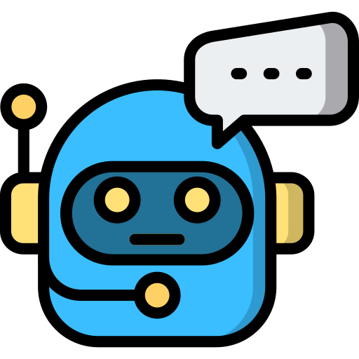

# Gurunath Pai
### Solutions Architect | AI Evangalist | [LinkedIn](https://linkedin.com/in/gurunath-pai) | [My Learnings](./learnings/learnings.html)

As a Solutions Architect based in Mumbai, I thrive on solving complex problems by designing elegant cloud architectures and impactful products.

Focus areas:
- Architecting intelligent, data-driven solutions using AI.
- Executing seamless cloud migrations and modernizing legacy systems for improved performance.
- Ensuring architectural excellence and financial accountability via AWS Well-Architected Reviews and FinOps practices.
- Data Architect and implement proof-of-concept prototypes using emerging technologies.

You can find more information about me in my [Manual of me](ManualOfMe.md). 

# Projects
**All case studies represent anonymized client work. Specific implementations and business details have been generalized to protect client confidentiality.**

##  A Salesforce-Integrated AWS Architecture for Automated Product Recommendations
**Industry:** Banking

### Problem
Financial advisors lacked an integrated system to map internal product offerings against specific client needs. The manual process of collecting client data and analyzing requirements caused a multi-week lag in providing product recommendations, resulting in missed opportunities and mismatched financial solutions.

### Solution & Impact
Architected and deployed an automated recommendation engine by integrating Salesforce with proprietary internal systems. The solution analyzes client interaction data and advisor conversations to deliver personalized product suggestions in real-time. This automation reduced the recommendation turnaround time from several weeks to under 30 minutes, significantly improving client engagement and advisor productivity.  

 

**Architecture explanation (Salesforce-integrated deployment):**  
This design keeps the external entry path separate from the core chatbot workload by using a dedicated integration VPC and PrivateLink. Traffic then moves into a main workload VPC where ECS Fargate services run across two availability zones for higher availability. The data layer is split by access pattern: DynamoDB for fast session state, Aurora PostgreSQL for knowledge retrieval, and S3 for object storage. CloudWatch provides centralized observability, and downstream applications consume chatbot outputs for business workflows.

**Numbered components and why they help the architecture:** 
**1. User request from Salesforce UI:** Users trigger chatbot requests from the Salesforce context. This improves adoption by keeping the workflow in tools already used by the sales team.

**2. API Gateway:** API Gateway is the front door for request validation, throttling, and controlled API access. This standardizes ingress security and protects backend services.

**3. AWS PrivateLink endpoint (integration VPC):** PrivateLink moves traffic privately between VPC boundaries without exposing internal services to the public internet. This reduces attack surface and supports stricter network controls.

**4. Private connectivity into workload VPC:** The private endpoint path bridges the integration VPC to internal load balancers in the workload VPC. This enables clear network segmentation with controlled service-to-service access.

**5. Network Load Balancer (NLB):** NLB handles private, low-latency L4 ingress and provides a stable target for PrivateLink traffic. This increases reliability and traffic-handling resilience.

**6. Application Load Balancer (ALB):** ALB performs Layer-7 routing to backend services and health-based traffic distribution. This improves request routing flexibility and service reliability.

**7. ECS Fargate services in AZ-1 and AZ-2:** Containerized chatbot/integration workloads run across multiple availability zones. This provides high availability, horizontal scaling, and removes server management overhead.

**8. S3 Bucket:** S3 stores files, generated artifacts, and long-lived objects used by the chatbot flow. This gives durable and cost-efficient object storage.

**9. CloudWatch:** CloudWatch collects logs, metrics, and alarms from the running stack. This strengthens observability and speeds up troubleshooting.

**10. DynamoDB:** DynamoDB stores low-latency session and conversation metadata used during chat flows. This supports high request throughput and responsive interactions.

**11. Aurora PostgreSQL:** Aurora PostgreSQL stores structured and retrieval-oriented data (including RAG-related context). This improves answer quality with consistent, queryable knowledge access.

**12. Downstream applications (APP1-APP5):** Chatbot outputs and events are integrated with downstream business systems. This extends value beyond the chatbot by enabling process automation and cross-application actions.

My responsibilities included:
- Led cross-team communication to align requirements between multiple stakeholders
- Designed RAG-powered chatbot architecture with session persistence for contextual interactions
- Architected cost-effective static website hosting solution with Cognito authentication
- Engineered automated data pipeline for continuous knowledge base updates
- Created technical documentation including architecture diagrams, effort estimates, and TCO calculations

**Technology stack:** ECS Fargate, API Gateway, Lambda, ECS, DynamoDB, Aurora, S3. 
**Technology stack:** 

##  Enterprise Search Platform
**Industry:** Corporate

### Problem
Addressed significant operational inefficiencies caused by fragmented data silos and the challenge of navigating vast repositories of internal documentation and application data.

### Solution
Spearheaded the development of a centralized Enterprise Search Platform, implementing automated document parsing and intelligent metadata tagging to drastically reduce information retrieval time and improve data discoverability across the firm.

 

**Architecture explanation (Salesforce-integrated deployment):**  

**Numbered components and why they help the architecture:**
- **1. Corporate Search engine:** Employee-facing entry point for enterprise search, keeping discovery inside the internal portal.
- **2. NGINX:** Reverse-proxy and traffic routing layer in front of the Spring Boot services.
- **3. Cloud Foundry:** Application platform hosting and managing the Spring Boot deployment runtime.
- **4. Spring Boot Web App:** Core search service instance (part of the Spring Boot app tier) handling API/business logic.
- **5. Logstash:** Ingestion and transformation pipeline that forwards processed records into the search cluster.
- **6. Kibana:** Search analytics and operational visibility layer for indexed data.
- **7. PostgreSQL:** Relational data store for structured metadata and application-side persistence.
- **8. Elastic Cluster:** Primary distributed search/indexing engine used for retrieval at scale.
- **9. Downstream Applications (APP1, APP2):** Consumer services that receive and use search outputs/events.
- **10. On-Prem Cluster of Servers:** Internal source/target systems maintained in the enterprise on-prem environment.

My responsibilities included:

##  The Rise of Conversational Marketing.
**Industry:** Retail

### Problem 
While traditional digital marketing reached a point of diminishing returns, a critical market segment shifted toward "dark social" and voice-first ecosystems. By failing to engage users on platforms like WhatsApp, WeChat, and voice assistants (Alexa/Google Assistant), the organization was overlooking a high-growth demographic and leaving significant market share on the table.

### Solution
I spearheaded a transition into Omnichannel Conversational Marketing, architecting a presence across high-engagement messaging and voice platforms. By deploying targeted content and automated interaction flows on these channels, we successfully captured untapped audience segments and established a high-velocity lead generation pipeline. 

  

**Architecture explanation :**  
This architecture is designed for an omnichannel conversational marketing platform. It ingests user interactions from various channels like web, mobile, Alexa, and Google Home. The core logic is containerized and runs on ECS Fargate for scalability and high availability across two availability zones. The data layer uses DynamoDB for session management and Aurora PostgreSQL for persistent data. API Gateway manages ingress traffic, and the entire setup is secured within a VPC with security groups. CloudWatch is used for monitoring, and the platform can integrate with other downstream applications.

**Numbered components and why they help the architecture:**
*   **1. Users:** End-users interacting with the chatbot via various channels.
*   **2. Dialogflow:** Google's NLU engine for understanding user intent.
*   **3. Chatbot Users:** Users interacting with the chatbot through a web interface.
*   **4. Mobile User:** Users on mobile devices interacting with the chatbot.
*   **5. Line Server:** Handles communication with the Line messaging platform.
*   **6. WeChat Server:** Handles communication with the WeChat messaging platform.
*   **7. Vendor NLU Engine:** A placeholder for another third-party NLU engine.
*   **8. API Gateway:** Provides a unified entry point for all API requests, handling authentication and routing.
*   **9. VPC (Virtual Private Cloud):** Provides a logically isolated section of the AWS Cloud where you can launch AWS resources.
*   **10. Security Group:** Acts as a virtual firewall for your instances to control inbound and outbound traffic.
*   **11. Network Load Balancer (NLB):** Distributes incoming traffic at the transport layer (Layer 4) for high performance.
*   **12. Application Load Balancer (ALB):** Routes traffic at the application layer (Layer 7) to different backend services.
*   **13. ECS Fargate services in AZ-1 and AZ-2:** Runs containerized applications without the need to manage servers, ensuring high availability.
*   **14. DynamoDB:** A fast and flexible NoSQL database service for all applications that need consistent, single-digit millisecond latency at any scale. Used here for session data.
*   **15. Aurora PostgreSQL:** A fully managed, PostgreSQL-compatible database for storing persistent application data.
*   **16. CloudWatch:** A monitoring and observability service for collecting and tracking metrics, logs, and events.
*   **17. Downstream applications:** Represents other business systems that can consume data or events from the chatbot platform.

My responsibilities included:

<!-- 
# Contributions
Beyond my technical work, I enjoy sharing knowledge through my APAWS newsletter and Medium blog, where I write about AWS architecture and MLOps patterns. I'm Ukraine's first AWS Community Builder in Machine Learning and contribute to open source — including Terraform/CDK reference implementations, cloud-nuke SageMaker modules, and the Excalidraw AWS icons set for architecture diagrams.

 

 

 -->

# My Learnings
I believe in continuous learning and sharing my knowledge with the community. Here are some of my writings on various topics.

[Explore my learnings](./learnings/learnings.html)

