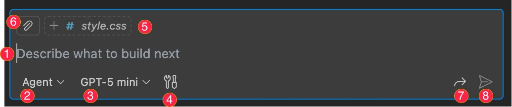

# A Deep Dive into the GitHub Copilot Chat Window in VS Code

GitHub Copilot is a powerful AI-powered pair programmer that can help you write code faster. The chat window in VS Code is one of the main ways to interact with Copilot. Let's break down the different parts of the chat window.

Here is a detailed explanation of the numbered features in the image:

1.  **Chat Input:** This is the primary area where you interact with Copilot. You can ask questions in plain English, paste code snippets, or use slash commands to get assistance.

2.  **Attach Context:** This feature allows you to provide Copilot with more context for your questions. You can attach the content of your currently active editor or a specific file, which helps Copilot provide more accurate and relevant responses.

3.  **Slash Commands:** Clicking this icon reveals a list of powerful slash commands. These are shortcuts for common tasks, such as:
    *   `/explain`: To get an explanation of the selected code.
    *   `/fix`: To fix issues in the selected code.
    *   `/tests`: To generate unit tests for your code.

4.  **Voice Input:** For a hands-free experience, you can use this to ask questions to Copilot using your voice.

5.  **Clear Chat:** This button allows you to clear the entire chat history and start fresh.

6.  **New Chat Session:** This button lets you start a new, separate chat session with Copilot.

7.  **Help and Documentation:** This button provides access to the official GitHub Copilot documentation, where you can find more information and guidance.

8.  **Additional Actions:** This menu provides more options to interact with the chat, such as copying the chat content, clearing the chat, or providing feedback on the Copilot's suggestions.
