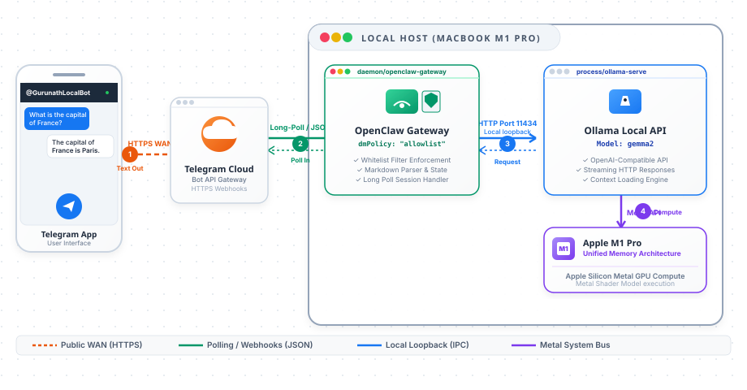

# Connecting Telegram to Local Ollama with Gemma via OpenClaw

Running Large Language Models (LLMs) locally gives you total privacy, no subscription fees, and complete control over your data. However, interacting with a local LLM from your mobile phone while on the go is usually a challenge. 

This guide walks you through setting up a secure, local AI Gateway using **OpenClaw** and **Ollama** running **Gemma 2** on a macOS (M1 Pro) machine, exposing it to your mobile phone via a **Telegram Bot** wrapper.

---

## 1. System Architecture

Here is how the end-to-end connectivity flows from your mobile device to your local machine:



---

## 2. Implementation Steps

### Step 1: Install and Run Ollama
First, run Ollama locally. Ollama serves the LLM via a local HTTP API.

1. Download Ollama from the [official website](https://ollama.com) and install it.
2. Open your terminal and pull down Google's Gemma 2 (9B parameters is recommended for M1 Pro):
   ```bash
   ollama run gemma2
   ```
3. Test that Ollama is listening by querying the version endpoint:
   ```bash
   curl http://localhost:11434/api/version
   # Expected Output: {"version":"0.1.48"} (or similar)
   ```

### Step 2: Create a Telegram Bot
You need a Telegram bot token to routing messages to and from your phone.

1. Search for `@BotFather` on Telegram.
2. Send the command `/newbot`.
3. Follow the wizard to name your bot and choose a unique username ending in `bot`.
4. Copy the generated **HTTP API Token** (e.g., `123456789:ABCdefGhIJKlmNoPQRsTUVwxyZ`).
5. Open a chat with your new bot and click **Start** (or send `/start`).

### Step 3: Install OpenClaw on macOS
OpenClaw coordinates the connection between Telegram's Bot API and Ollama.

1. Download and run the install script:
   ```bash
   curl -fsSL https://openclaw.ai/install.sh | bash
   ```
2. Initialize the gateway and install it as a system service daemon (which runs continuously in the background):
   ```bash
   openclaw onboard --install-daemon
   ```
3. This creates a configuration file at `~/.openclaw/openclaw.json`.

### Step 4: Configure OpenClaw
Open the config file using your preferred text editor (e.g., `nano ~/.openclaw/openclaw.json`).

Modify the **Models** section to point to Ollama:
```json
{
  "models": {
    "default": "gemma2",
    "providers": {
      "ollama": {
        "baseUrl": "http://localhost:11434/v1",
        "apiKey": "ollama-local",
        "api": "openai-completions"
      }
    }
  }
}
```

Modify the **Channels** section to enable Telegram and secure access. 
> [!WARNING]
> Since anyone can find your bot on Telegram, **never** leave the bot open to everyone. Restrict access using the `allowFrom` whitelist!

```json
{
  "channels": {
    "telegram": {
      "enabled": true,
      "botToken": "YOUR_BOT_TOKEN_FROM_BOTFATHER",
      "dmPolicy": "allowlist",
      "allowFrom": [
        "YOUR_TELEGRAM_USER_ID"
      ]
    }
  }
}
```

*Note: You can find your Telegram User ID by sending `/start` to `@userinfobot` or `@RoseBot` on Telegram.*

### Step 5: Restart and Verify
Restart the OpenClaw daemon for the configurations to take effect:
```bash
openclaw gateway restart
```

Now, send a message to your Telegram bot (e.g., `"Hi Gemma, explain quantum computing like I'm five."`). You should get an immediate streaming response generated locally by Gemma 2 on your M1 Pro Mac!

---

## 3. Interactive Troubleshooting Q&A

**Q: OpenClaw fails to connect to Ollama. The logs show `ECONNREFUSED 127.0.0.1:11434`.**
* **A:** This means Ollama is not running. Launch the Ollama app from your macOS Applications or start it in terminal with `ollama serve`. You can verify it is active by accessing `http://localhost:11434` in your browser.

**Q: I text the bot in Telegram but get no reply, and the terminal console is silent.**
* **A:** Check three things:
  1. Ensure the OpenClaw service is running (`openclaw status`).
  2. Verify your Telegram bot token is correctly entered in `~/.openclaw/openclaw.json`.
  3. Ensure your Telegram User ID matches the entry in the `allowFrom` whitelist. If OpenClaw receives messages from an unauthorized ID, it silently discards them for security.

**Q: Gemma 2 responds very slowly, lagging for several seconds between words.**
* **A:** On an M1 Pro Mac, Gemma 2 (9B) should compile at ~20-30 tokens/sec utilizing Metal GPU acceleration. If it's slow:
  1. Ensure you have closed other RAM-heavy apps (Docker, heavy IDEs) as Unified Memory is shared.
  2. Switch to a smaller model, such as Gemma 2 (2B) or Qwen 2.5 (3B):
     ```bash
     ollama pull gemma2:2b
     ```
     Then update the default model in `openclaw.json` to `"gemma2:2b"`.

<!-- --- -->

<!-- ## 4. Video Storyboard & Script
Here is a blueprint to create a quick 2-minute video showing off your setup for YouTube:

### Storyboard Outline
1. **Scene 1: Introduction (0:00 - 0:20)**
   * **Visual:** Show yourself holding your mobile phone with Telegram open.
   * **Narrator:** *"Today, we are building a fully private local AI chatbot. I'm texting Gemma 2 running on my M1 Pro Mac in the other room directly from Telegram on my phone, and it responds instantly."*
2. **Scene 2: Ollama & Gemma (0:20 - 0:50)**
   * **Visual:** Screen recording of your Mac terminal running `ollama run gemma2` and demonstrating a quick query.
   * **Narrator:** *"First, we download Ollama and run Gemma 2. It runs locally on Apple Silicon GPU, completely offline."*
3. **Scene 3: Telegram BotFather (0:50 - 1:15)**
   * **Visual:** Screencast of creating the bot with BotFather and obtaining the HTTP API key token.
   * **Narrator:** *"Next, we create our Telegram interface using BotFather to secure our API token."*
4. **Scene 4: OpenClaw Configuration (1:15 - 1:45)**
   * **Visual:** Visual of opening `openclaw.json` and entering the Ollama endpoint and Telegram botToken, pointing out the `allowFrom` whitelist block.
   * **Narrator:** *"We bridge the two with OpenClaw. The configuration is simple, and we ensure security by whitelisting our specific Telegram ID so no one else can query our machine."*
5. **Scene 5: Demo & Wrap-up (1:45 - 2:00)**
   * **Visual:** Split screen showing the Telegram app on mobile receiving streaming answers, and terminal logs scrolling in OpenClaw in real-time.
   * **Narrator:** *"And there it is! A private, local AI assistant, accessible from anywhere in the world on your phone. Hit subscribe for more local AI hacks!"* -->
